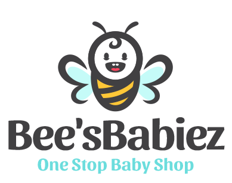

# 🐝 BeesBabes - Kids' Product Management Platform
<p align="center">
  
</p>


**BeesBabes** is a modern **PERN stack** application built to showcase and manage kids' products. It offers seamless **CRUD** operations for products and integrates rate limiting for security.

## 🚀 Features

- Full-featured **CRUD operations** for kids' products
- **Rate limiting** using Arcjet for enhanced API protection
- Responsive and stylish UI with **Tailwind CSS** and **Daisy UI**
- **Fast development** using Vite + React
- **PostgreSQL** as the relational database (Neon-hosted)
- **Express.js** powered backend

---

## 🛠️ Tech Stack

| Layer       | Technology              |
|------------|--------------------------|
| Frontend    | Vite + React            |
| Styling     | Tailwind CSS + Daisy UI |
| Backend     | Express.js              |
| Database    | Neon PostgreSQL         |
| Rate Limiting | Arcjet                | 
----------------------------------------

## 📁 Project Structure
/frontend → Vite React frontend
/backend → Express backend
.env → Environment variables


---

## 📦 Environment Variables

Create a `.env` file in your `/server` folder with the following structure:

```env
PORT=your_port_number

# PostgreSQL Database
PGUSER=your_postgres_user
PGPASSWORD=your_postgres_password
PGHOST=your_postgres_host
PGDATABASE=your_postgres_db

# Arcjet Configuration
ARCJET_KEY=your_arcjet_key
ARCJET_ENV=your_arcjet_env


 Install Dependencies

cd backend
npm install

cd ../frontend
npm install


🧪 Running the Project

-Start Backend Server
cd server
npm run dev

-Start Frontend (Vite)
cd ../client
npm run dev


🙌 Acknowledgments
Vite
Express
Neon
Arcjet
Tailwind CSS
Daisy UI


📫 Contact
Feel free to connect with me for any queries or collaborations!

Made with ❤️ for kids' happiness
